# Overview
This pipeline is an implementation of ortholog callers (currently availble: [OrthoFinder](https://github.com/davidemms/OrthoFinder) and [Broccoli](https://github.com/rderelle/Broccoli)) in Nextflow.
This pipeline applies a phylogeny-aware reconcilation of ortholog phylogeny (gene family trees) and a species tree using [GeneRax](https://github.com/BenoitMorel/GeneRax), followed by a final parsing of hierarchical orthogroups using [Possvm](https://github.com/xgrau/possvm-orthology)



# Installation
First, install nextflow on your system. You will also need docker, singularity, OR apptainer installed.
```
git clone --recurse-submodules https://github.com/dmckeow/orthologs.git
```
# Usage
```
main.nf -params-file inputs/params-example.json
```
All inputs are provided via a params file. See **inputs/params-example.json**.
Defaults for all pipeline parameters are set in **nextflow.config**.
Resource allocation for specific processes is controlled by **conf/base.config**.
The tool-specific parameters can be controlled in **conf/modules.config**.
If you wish to use this pipeline in a SLURM environment then see **conf/slurm.config**. You will need to alter this config to suit your system.

## Required inputs
1. Samplesheet 1 (--samplesheet). See **inputs/samplesheet1.csv**. Three columns, csv delimited:  
  * id = unique name for the sample or genome, letters, underscores, and digits ONLY,  
  * fasta = path to the protein fasta,  
  * taxonomy = any group to which the sample belongs, does not have to be taxonomy, it is simply to aid organisation.
## Key optional inputs
1. Samplesheet 2 (--search_params). *Only required if using the prefilter_hmmsearch option*. See **inputs/samplesheet2.csv**. Three columns, csv delimited:  
  * gene_family_info = path to file corresponding to the hmmprofiles in hmm_dir. See **example_data/genefam.tsv**,  
  * gene_family_name = gene family name that corresponds exactly to the class_name column of gene_family_info,  
  * hmm_dir = path to directory containing hmmprofiles of gene families (corresponds exactly with class_name). See **example_data/hmms**.
2. Species tree (--species_tree). **Recommended**, if not provided then [SpeciesRax](https://github.com/BenoitMorel/GeneRax) will be used to generate a species tree based on a subset of single copy orthologs identified by the pipeline. This tree will inform the final HOGs, so it may be more robust to provide a curated species tree.

## Other pipeline parameters

outdir = 'results/example' (location of your results)  
workdir = 'work' (location of intermediate outputs)  
runName = "${params.outdir.tokenize('/')}" (The pipeline names the run after the outdir)  
mcl_inflation = 2.5 (For OrthoFinder. See its documentation. Larger MCL means larger orthologs.)  
array_size = 1 (If using an HPC environment, set this to a reasonable number to allow job array submission. The number given will be the max number of jobs submitted at any one time. This will make the pipeline faster.)  

### Orthogroup filtering options

min_num_seq_per_og         = 4 (The minimum number of proteins a gene family must contain)  
min_num_spp_per_og         = 2 (The minimum number of species per gene family)  
min_prop_spp_for_spptree   = 0.75 (The minimum number of taxonomic groups per family)  
min_num_grp_per_og         = 1 (The maximum mean copy number per species)  
max_copy_num_spp_tree      = 5 (The maximum mean copy number per species for use in species tree estimation)  
max_copy_num_gene_trees    = 10 (The minimum proportion of species that a gene family must contain for use in species tree estimation)  

### Alignment method
aligner                    = 'witch' (Options: witch, mafft)  

### Tree Inference method
tree_method                = 'fasttree' (options: fasttree, iqtree)  
outgroups                  = 'none'  

### Alignment trimmer options
msa_trimmer                = 'none' (options: clipkit, cialign)  
min_ungapped_length        = 20  

### IQ-TREE options
tree_model                 = 'LG+F+G4'  
tree_model_pmsf            = 'none'  

### Workflow control options
run.prefilter_hmmsearch    = true (If true, runs hmmscan against the hmmprofiles specified by search_params (samplesheet 2). Otherwise it runs on the whole fastas provided)  
run.orthofinder            = true (Pipeline will run each ortholog caller in parallel)  
run.broccoli               = true  
run.broccoli_array         = false (If using an HPC environment, use this instead of broccoli to speed broccoli up)  
    


