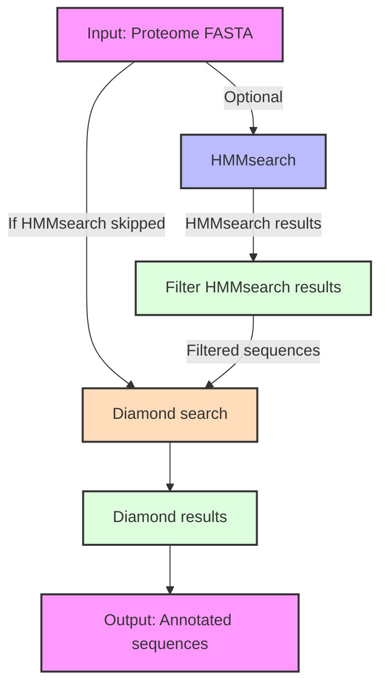

```mermaid
graph TD
    A[Input: Proteome FASTA] -->|Optional| B[HMMsearch]
    A -->|If HMMsearch skipped| D[Diamond search]
    B -->|HMMsearch results| C[Filter HMMsearch results]
    C -->|Filtered sequences| D
    D --> E[Diamond results]
    E --> F[Output: Annotated sequences]

    style A fill:#f9f,stroke:#333,stroke-width:2px
    style B fill:#bbf,stroke:#333,stroke-width:2px
    style C fill:#dfd,stroke:#333,stroke-width:2px
    style D fill:#fdb,stroke:#333,stroke-width:2px
    style E fill:#dfd,stroke:#333,stroke-width:2px
    style F fill:#f9f,stroke:#333,stroke-width:2px
```