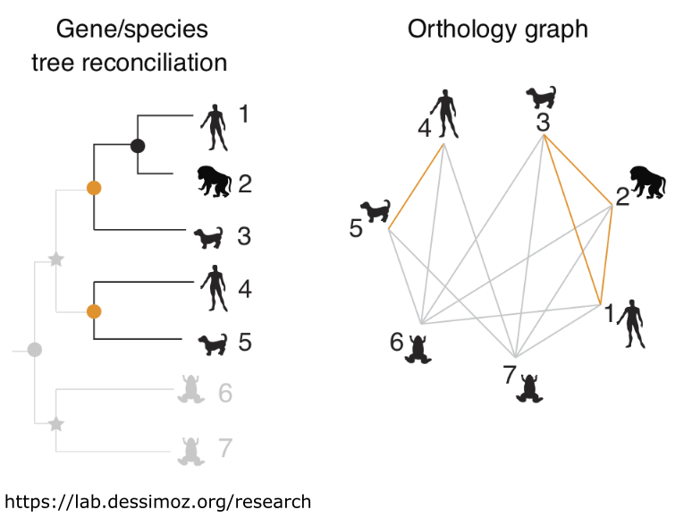

# Orthology inference in the BCA
* Multiple tool options
* Trade-off between speed and method
* Broad taxonomic range
* Gene families with complex domain structures
<!--
* Multiple tool options
  * Different orthology inference methods different trades offs
  * Need pipeline with flexibility to try different tools/workflows
* Trade-off between speed and method
  * Run whole proteome vs only select gene families
  * Tool/parameter choice with a speed/accuracy trade off
* Broad taxonomic range
  * More saturation, duplication, losses
  * New classes of gene families
* Gene families with complex domain structures
  * May be computationally wasteful
  * May be phylogenetically uninformative
-->
---

# How are orthologs inferred?

* **Graph based (SonicParanoid2)**, Pairwise distances:
    * Best bidirectional hits (DIAMOND) - precise, but misses orthologs
    * Similarity networks (MCL) - more inclusive, but falsely merges orthologs
* **Tree based (Broccoli)**, Phylogeny of protein clusters:
    * Better at identifying speciation & duplication
* **A hybrid of the two (OrthoFinder)**
<!-- 
* **Graph based (SonicParanoid2)**
  * Pairwise distances:
    * Best bidirectional hits (DIAMOND) - precise, but misses orthologs
    * Similarity networks (MCL) - more inclusive, but falsely merges orthologs
    * Graph based methods underestimate evolutionary distances, bad at ancient relationships

* **Tree based (Broccoli)**
  * Phylogeny of protein clusters:
    * Better at identifying speciation & duplication
    * More computationally demanding
* **A hybrid of the two (OrthoFinder)**
-->
---

# The current orthology pipeline

* **Nextflow**, options to use **tree**, or **hybrid** tools (Broccoli, OrthoFinder)
* OGs from all tools subject to a final reconciliation with a species tree using **GeneRax** & **Possvm**
* Using test dataset from TF evolution, **155 genomes**, & gene families Ets, Homeodomains, zf-C2H2, zf-met

<!--

-->
---
# Benchmarking orthologs
* OGs from tools (initial OGs)
  * To be compared later vs OGs reconciled using GeneRax
  * Other variables include tools paramters, and gene family
* Currently working on:
  * OG contamination/homogeneity
  * Phylogenetic distribution of OG
  * OG granularity (too strict or too inclusive?)
---
# Next
* **The pipeline**:
  * Make it faster (Broccoli so *slow*...)
  * Stress test - more gene families
  * Add more tool options
  * Generally make it friendlier - parameters, log messages, etc
* **Benchmarking OGs**:
  * Arrive at a thorough analyses/report
<!--
Many small jobs in an array > single parallelised process
-->